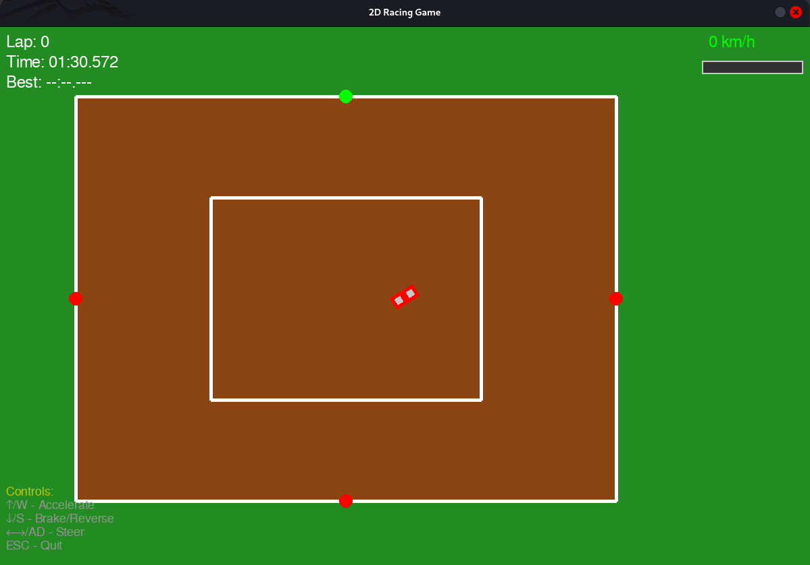

# 2D Racing Game

A simple 2D first-person racing game built with Pygame, designed to be later ported to Unreal Engine.

## 🛠️ Tech Stack

### Core Technologies
- **Language**: Python 3.8+
- **Game Engine**: Pygame
- **Version Control**: Git with GitHub

### Key Dependencies
- `pygame`: Core game development and rendering
- `math`: Built-in Python module for mathematical operations
- `enum`: For defining game constants and states
- `typing`: For type hints and better code documentation

### Development Tools
- **Code Editor**: VS Code
- **Version Control**: Git
- **Environment Management**: Python venv
- **AI Assistant**: Windsurf (for code reviews and suggestions)



## Features

- First-person perspective racing
- Simple physics-based car controls
- Custom track with collision detection
- Speedometer and lap timer
- Basic HUD with game information

## Installation

1. Make sure you have Python 3.8 or higher installed
2. Install the required dependencies:

```bash
pip install -r requirements.txt
```

## Running the Game

To start the game, run:

```bash
python main.py
```

## Controls

- **Up Arrow / W**: Accelerate
- **Down Arrow / S**: Brake/Reverse
- **Left/Right Arrows / A/D**: Steer
- **ESC**: Quit game

## Project Structure

- `main.py`: Entry point of the game
- `src/`: Source code
  - `core/`: Core game logic
    - `game.py`: Main game loop and state management
    - `car.py`: Player vehicle implementation
    - `track.py`: Track generation and rendering
  - `ui/`: User interface components
    - `hud.py`: Heads-up display
  - `utils/`: Utility functions and constants
    - `constants.py`: Game-wide constants

## 🤖 AI Integration Plan

### 🧱 Code and Feature Generation
- **Component Scaffolding**: Using AI to generate boilerplate code for game components (e.g., car physics, track generation)
- **Feature Implementation**: AI-assisted implementation of complex features like collision detection and pathfinding
- **Code Refactoring**: Using AI suggestions to improve code structure and performance

Example prompt used:
```
Help me implement smooth car physics in Pygame that includes:
- Realistic acceleration and deceleration
- Drifting mechanics
- Collision detection with track boundaries
- Lane changing with smooth transitions
```

### 🧪 Testing Support
- **Unit Test Generation**: AI-assisted creation of test cases for game mechanics
- **Edge Case Identification**: Using AI to identify potential edge cases in game logic
- **Performance Testing**: AI-generated performance benchmarks

### 🔍 In-Editor/PR Review Tooling
- **Tool**: Windsurf
- **Usage**:
  - Code reviews and suggestions during development
  - Generating meaningful commit messages
  - Identifying potential bugs and performance issues
  - Suggesting code optimizations

Example PR review prompt:
```
Review this pull request for the car physics implementation. 
Focus on:
1. Performance optimizations
2. Potential edge cases in collision detection
3. Code style consistency
4. Any potential memory leaks
```

## Future Improvements

- Add AI opponents with varying difficulty levels
- Implement power-ups and collectibles
- Add sound effects and background music
- Improve graphics with better sprites and animations
- Add different game modes (Time Trial, Championship, etc.)
- Port to Unreal Engine for 3D version

## Version 1.1: Side-Scrolling Update (Planned)

### New Features
- **Lane-Based Gameplay**: Cars move left-to-right or right-to-left in designated lanes
- **Multiple Tracks**: Varied environments including city, desert, and mountain themes
- **Enhanced Vehicle Models**: Detailed car sprites with different models and colors
- **Track Features**:
  - Multiple lanes (2-4) for strategic overtaking
  - Traffic cars moving in both directions
  - Environmental hazards and obstacles
  - Checkpoints and finish lines
- **Game Modes**:
  - Time trial
  - Career mode with progressive difficulty
  - Endless mode

### Technical Improvements
- Redesigned car physics for side-scrolling
- Dynamic track generation
- Improved collision detection
- Optimized performance for smooth scrolling

### Future Expansion
- Multiplayer support (local/online)
- Power-ups and special abilities
- Customization options for vehicles
- More tracks and environments

## License

This project is open source and available under the MIT License.
